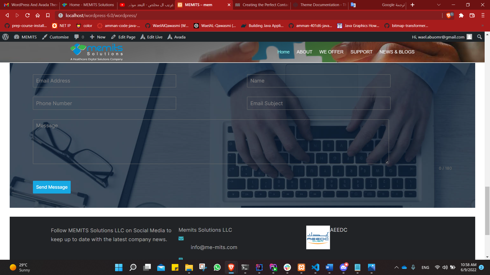
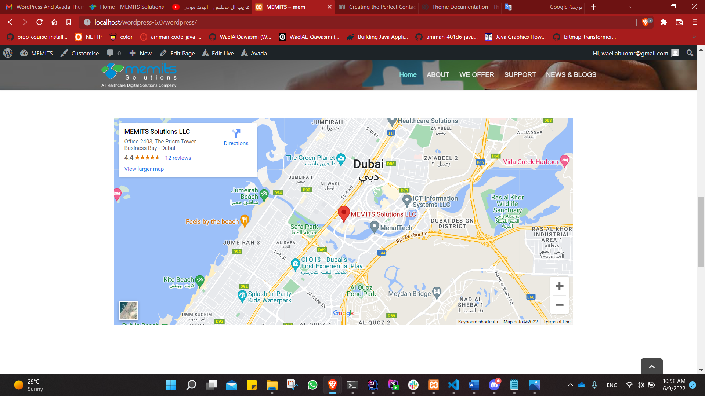
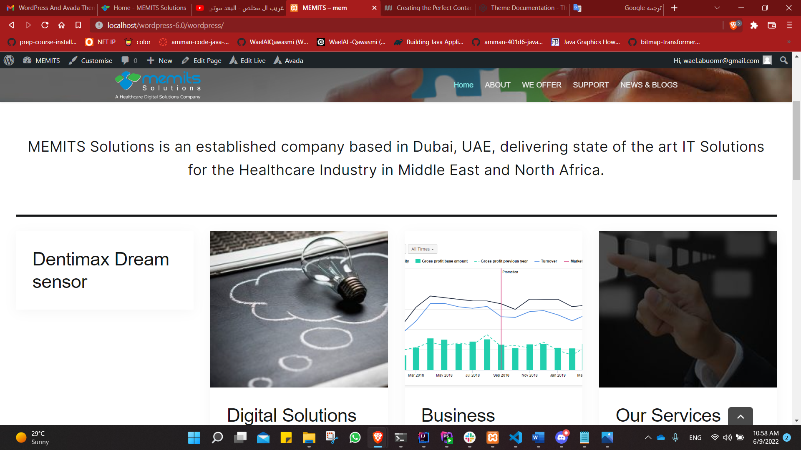

# Memits Solutions assignment
 ## Solution procedures
I follow this procedures to solve this task
1.  install WordPress
2. configure it with my local machine
3.  set the username: wael.abuomr@gmail.com & password: Wa987654321*
4. install the Avada theme and customize it
5. I open the   Memits Solutions website and understand the widget on it
6. I start with the heder and I tried to make it like the website
7. I work in the body and make the website
7. then I install Stackable - Gutenberg Blocks plugin to make a card like the website
8. after that I install the Forminator plugin to create contact forme
9. then I added the map form HTML embedded from google map
10.  I add the Marquee image crawler plugin to add partner - but I don't have time to handle it  like in the website"
11. in the end I added the footer from the website
## Difficulties
-	I faced  a problem with installing the theme because it needs to registration serial and requires a plugin
-	 But I handle it by using another plug in and building it manually
-	I  faced a problem when I search for the best plug in to give me  same view in website but I handle it by good searching 
-	Creating a replica takes more time, so that time was part of the challenges

## SecreenShote

## References

-   [res1](https://www.me-mits.com/)
-	[res2](https://wpstackable.com/)
-	[res3](https://theme-fusion.com/documentation/avada/)
-	[res4](https://wpmudev.com/blog/)creating-the-perfect-contact-form-with-forminator/)

   

